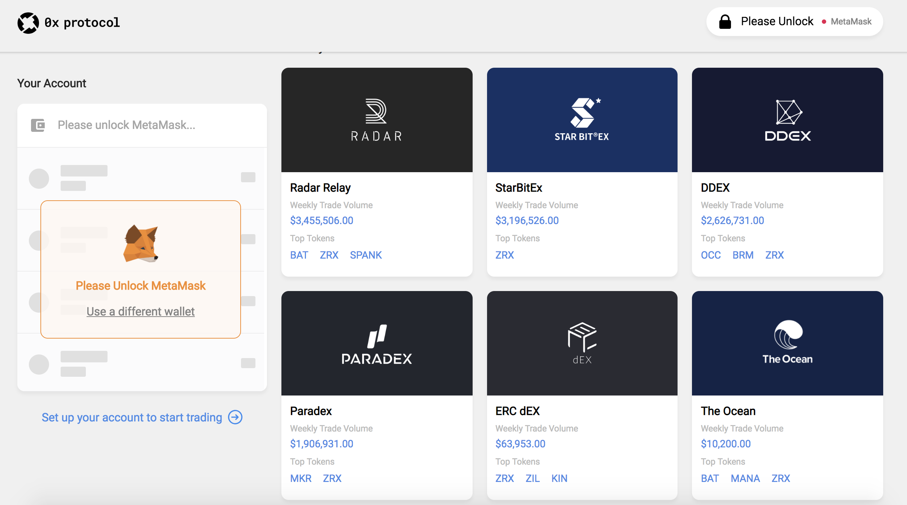

# 0x Protocol

#### Description

The 0x protocol facilitates the exchange of a growing number of Ethereum-based tokens including currencies, game items, and many more digital assets.

#### Interface

#### Important Links

Site: [https://0xproject.com/](https://0xproject.com/)  
Twitter: [https://twitter.com/0xProject](https://twitter.com/0xProject?lang=en)  
GitHub: [https://github.com/0xProject](https://github.com/0xProject)

