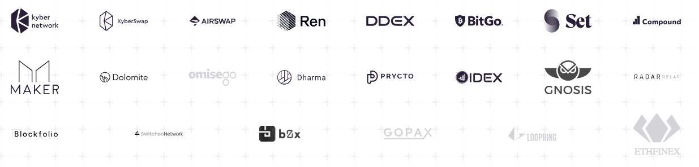

# Wrapped Bitcoin (WBTC)

## What is WBTC?

WBTC brings greater liquidity to the Ethereum ecosystem including decentralized exchanges (DEXs) and financial applications. Today, the majority of trading volume takes place on centralized exchanges with Bitcoin. WBTC changes that, bringing Bitcoin’s liquidity to DEXs and making it possible to use Bitcoin for token trades.

WBTC standardizes Bitcoin to the ERC20 format, creating smart contracts for Bitcoin. This makes it easier to write smart contracts that integrate Bitcoin transfers.

Maintaining various nodes and managing transaction types in order to support multiple currencies can be onerous. Now exchanges, wallets, and payment apps only need to handle an Ethereum node.

### WBTC DAO

The addition and removal of merchants and custodians will be an open process controlled by a multi-signature contract. Keys to the multi-sig contract will be held by institutions as part of the WBTC DAO.

### Merchants

Merchants perform key roles for the WBTC community and are sources of token distribution. They interact with custodians in order to mint and burn WBTC and provide KYC/AML for users.

### Custodians

The custodian provides reliable, institutional-grade security for your WBTC. All WBTC issued will be fully backed and verified through on-chain proof of reserves.

## Partners

## Resources

* [WBTC Contract](https://etherscan.io/address/0x2260fac5e5542a773aa44fbcfedf7c193bc2c599)
* [Website](https://www.wbtc.network/)
* [WBTC Dashboard](https://www.wbtc.network/dashboard/order-book)

