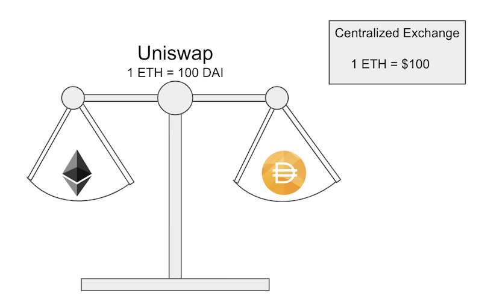

# Understanding Uniswap

## Summary

Uniswap is an exchange protocol that allows users to trustlessly swap ERC20 tokens. Rather using the traditional order book model, Uniswap pools tokens into smart contracts and users trade against these liquidity pools. Anyone can swap tokens, add tokens to the pool to earn fees, or list a token on Uniswap.

This guide is meant to help beginners understand how Uniswap works under the hood. While the interface may appear simple, there is a lot going on behind the scenes.

*I recommend this [resource](https://defitutorials.substack.com/p/the-ultimate-guide-to-uniswap) if you are more interested in understanding how to use the Uniswap interface rather than how it works.*

## ERC20 Token Primer

ERC20 tokens are the most common type of token built on top of Ethereum. They are [fungible](https://en.wikipedia.org/wiki/Fungibility) in nature, meaning that there isn’t a distinction between individual tokens. For example, if I have 100 metal marbles in my hand that are all the same size and color, it doesn’t matter which one I give you. In the same way, if I have 100 of the same ERC20 token, it doesn’t matter which one I give you. This contrasts with ERC721 tokens which are non-fungible tokens (NFTs) such as cryptokitties.

ERC20s can be thought of as the most simple unit of account for a wide range of use cases including currency, rewards points, debt slips, interest accruing bonds, and much more. They are also highly divisible and can be sent in small increments. Since this type of token is so pervasive, it is important to develop a simple way of swapping between them.

*Please view the link [here](https://eips.ethereum.org/EIPS/eip-20) for more information on ERC20s.*

## Overview of Uniswap’s Contracts

When viewing Uniswap’s website, it is important to keep in mind that it is much more than just the interface. Uniswap starndaizes how ERC20s are exchanged with a set of smart contracts. Anyone can build an interface that connects to these contracts and instantly be able to start exchanging with everyone else that is using Uniswap. In addition, for machines, they simply need to know the addresses of the contracts and with a little extra code, they too are able to trade on Uniswap as well. 

There are two different types of contracts that make up Uniswap. The first type is known as an Exchange contract. Exchange contracts hold a pool of a specific token and Ether which users can swap against. The second kind of contract is the Factory contract which is in charge of creating new Exchange contracts and registers the ERC20 token address to its Exchange contract address.

There are no listing fees to add a token on Uniswap, instead anyone can call a function on the Factory contract to register a new token. The Factory contract checks with its records to see if that token already has an exchange contract. If it doesn’t then a new Exchange contract is deployed, however, each unique token can only have one exchange contract.

The graphic below is an example of when DAI was added to Uniswap. Someone first called the createExchange function in the Factory contract with DAI’s contract address. The Factory contract checks it’s registry to see if an Exchange contract has been created for that token address. If there is no Exchange address listed, the factory contract deploys an exchange contract and records the Exchange address in its registry.

## Liquidity Pools
Uniswap is unique in that it doesn’t use an order book to derive the price of an asset. In a centralized exchange, such as Coinbase Pro, the price of an asset listed on the exchange is determined by where the highest price someone is willing to pay and the lowest price someone is willing to sell meet. We can see in the image below, that the highest bid price for BTC on Coinbase Pro at that point was $9301.36 and the lowest asking price was $9301.37.

Instead Uniswap uses the Exchange contracts to pool both Ether and a specific ERC20. When trading Ether for a token, Ether is sent to the contract’s pool and the token is given back to the user. As a result, the user doesn’t need to wait for a counterparty in order to exchange or worry about specifying a price. Since anyone can list a token and users don't need to worry about matching with someone else, it is very easy to avoid any bootstrapping issue when first launching a token.

The amount that is returned from swapping is based on a constant market maker formula. The graph below illustrates how the formula works. Essentially, a user is guaranteed to have their trade executed due to the fact that no matter how much of an asset you put into the contract, there will always be some amount returned back to you. This is due to the fact that the more of an asset that you add to one side of the pool, the further along the line it pushes you for the other asset.

*You can learn more about the formula [here](https://ethresear.ch/t/improving-front-running-resistance-of-x-y-k-market-makers/1281).*

But if users are only just sending cryptocurrency, how does the ratio of Ether to token remain priced correctly? The answer is the pools maintain a ratio relative to the price of the rest of the market through people [arbitraging](https://en.wikipedia.org/wiki/Arbitrage) the pool. 

Imagine that the DAI:ETH pool is expressed in terms of a scale and when the scale is balanced, the pool is appropriately priced relative to the market price of a centralized exchange. Let's make this more clear with an example. Let’s say that the current price for ETH in USD on a centralized exchange is $150 and the ratio in the Uniswap DAI:ETH pool is 150 Dai for 1 Eth. As a result, our scale is balanced because the pool reflects what the market price is. 

Now let’s assume that there is a movement in the market that pushes the price of ETH to $100 on the centralized exchange. Due to the price movement we can now see that our scale is off balance relative to the market price because people can now swap 1 ETH for 150 DAI when the market price on a centralized exchange is $100 for 1 ETH. 

In response, someone can now put ETH into the pool, draw out DAI, then sell the DAI back for ETH on the centralized exchange, and repeat. They can do this until the pool has balanced out and reflects the current market price on a different exchange.

As a result, third party arbitrages play a large role in maintaining the correct ratio of token to Ether in Uniswap pools.

## Swapping ERC20 ⇄ ERC20
Uniswap allows users to directly swap an ERC20 to another ERC20 in a single transaction. In the image below, a user calls the tokenToTokenSwap() function and passes in address of the token they would like to receive. In the example below, the user has DAI and would like to receive Maker. So they call the tokenToTokenSwap function which adds DAI to the DAI Exchange pool and kicks Ether to the MKR Exchange contract pool and returns MKR to the user that initially sent the transaction. 

## Liquidity Providers

Uniswap incentives users to add liquidity to pools by rewarding providers with fees collected by the protocol. A 0.03% fee is taken for swapping between Ether and a token and roughly a 0.06% is token for token to tokens swaps.

When an Exchange contract is first created for a token, both the pools are empty. The first person that deposits into the contract is the one that determines the ratio between the token and Ether. If they deposit a ratio that is different from what the current market rate is, then an arbitrage opportunity is available. When liquidity providers are adding to the pool, they should add a proportional amount and Ether to the pool or risk the check of having the pools be subject to arbitrage.

Special ERC20 tokens known as liquidity tokens which are minted to the address in proportion to how much liquidity the user contributed to the pool. The tokens are burned when the user gives them back to the contract in exchange for the liquidity they contributed plus the fees that we accumulated while their liquidity was locked.

*I recommend reading [this article](https://medium.com/@pintail/uniswap-a-good-deal-for-liquidity-providers-104c0b6816f2) if you are curious about the advantages and risk of being a liquidity provider.*

## Conclusion

## Resources

* [Uniswap Whitepaper](https://hackmd.io/C-DvwDSfSxuh-Gd4WKE_ig)
* [Uniswap — A Unique Exchange](https://medium.com/scalar-capital/uniswap-a-unique-exchange-f4ef44f807bf)
* [Improving front running resistance of x*y=k market makers](https://ethresear.ch/t/improving-front-running-resistance-of-x-y-k-market-makers/1281)