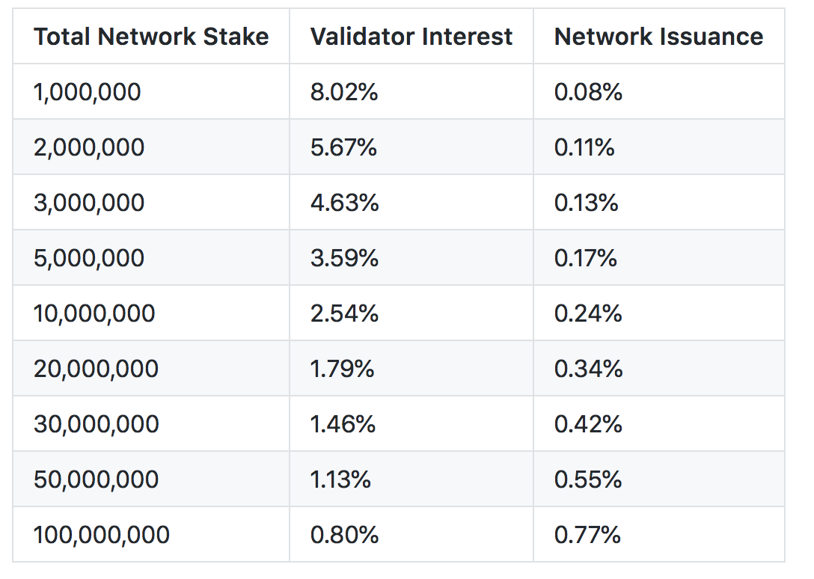
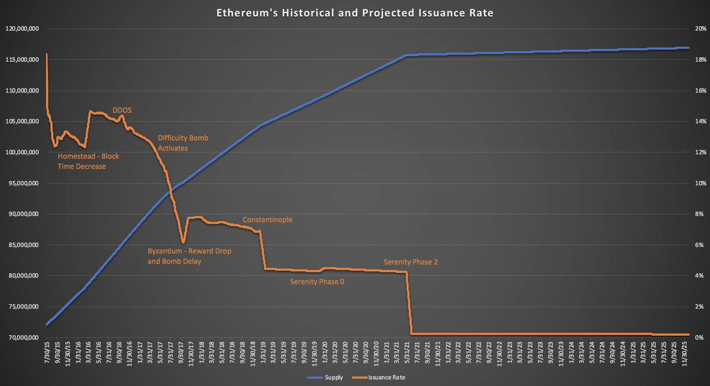

# Monetary Policy

## Genesis Block

As part of the Ethereum genesis block, initial contributors to Ethereum sale were allocated 60,000,000 Ether. Another 12,000,000 Ether was given to the development fund which was distributed among early contributors and the Ethereum Foundation.

## Historical Issuance Impacts

**Block Reward Reductions**  
Every block produced on the Ethereum network has an associated block reward which incentivizes miners to support the network. On top of the base block reward, miners that find an [uncle blocks](../using-ethereum/ethereum-network-basics/mining/uncle-blocks.md) receive ~75% of the current block reward. This results in a growing supply of Ether across time. The history of the block reward are as follows:

* Block 0 to Block 4,369,999: 5 Ether
* Block 4,370,000 to current: 3 Ether \(changed via [EIP-649](https://github.com/ethereum/EIPs/blob/master/EIPS/eip-649.md)\)
* The Constantinople hard fork, targeted for block 7,080,000, will cut block rewards to 2 Ether per block via [EIP-1234](https://github.com/ethereum/EIPs/blob/master/EIPS/eip-1234.md).

**Other Events**  
Issuance rate is also impacted by the speed of blocks. There have been a few other events in Ethereum's history which has impacted the issuance rate. Some planned and some not planned.

* The Homestead fork in March 2016 saw a decrease in block times and therefore a temporarily increase in issuance rate.
* In late 2016, the network was under DDoS attack. This increased the uncle rate, therefore causing a temporary rise in issuance rate.
* In mid 2017, a mechanism called the difficulty bomb \(or "Ethereum Ice Age"\) started to kick in. This mean that difficulty of mining a block rose, therefore slowing down blocks. This resulted in a dramatic decrease in issuance rate.
* In late 2017, Byzantium fork was released which delayed the difficulty bomb and also reduced block rewards from 5 to 3.

## Proof of Stake Impact

According to the current [Eth 2.0 spec](https://notes.ethereum.org/s/Syj3QZSxm), issuance rate will be greatly reduced as a part of Proof of Stake. There will be a [sliding scale](../roadmap/serenity-phases/eth-2.0-economics.md#staking-rewards) between total amount of Ether at stake and annual interest earned by stakers. The current spec would produce the following annual interest and inflation numbers based on total network stake:

## Historical and Future Supply Forecast

There are three majors upcoming factors when it comes to Ethereum's issuance rate and supply curve. They are:

* Constantinople Hard Fork: block rewards drop from 3 to 2.
* [Serenity Phase 0](https://github.com/ethhub-io/ethhub/blob/master/roadmap/timeline/serenity-phases.md): Slight bump in issuance due to Beacon Chain launch.
* [Serenity Phase 2](https://github.com/ethhub-io/ethhub/blob/master/roadmap/timeline/serenity-phases.md): Strong drop in issuance due to the PoW chain fading away.

