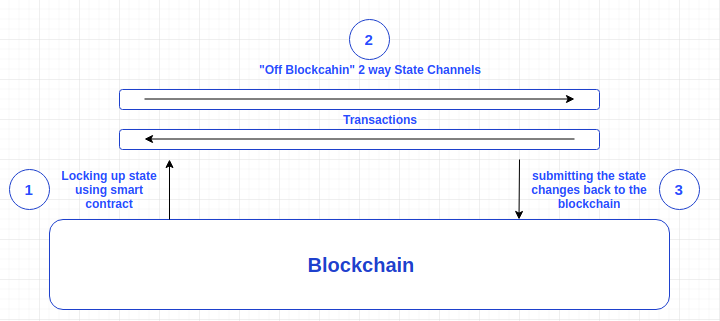

# State Channels

## What Are State Channels?

State channels are a very broad and simple way to think about blockchain interactions which could occur on the blockchain, but instead get conducted off of the blockchain, without significantly increasing the risk of any participant. The most well known example of this strategy is the idea of payment channels in Bitcoin, which allow for instant fee-less payments to be sent directly between two parties.

State channels are very similar to the concept of payment channels in Bitcoin’s Lightning Network, but instead of only supporting payments, they also support general ‘state updates.’ For example, moves conducted in a game of Chess could be updated in a state channel and only broadcasted to the Ethereum network once the game is finished. This magnifies the number of computation developers can move off-chain.

## How do State Channels work?

State channels work by “locking up” some portion of blockchain state into a multisig contract, controlled by a defined set of participants. The state that is “locked up” is called a state deposit. For instance, this might be an amount of ether or an ERC20 token, but could also be a cryptokitty or an ENS domain name.

After the state deposit is locked, channel participants use off-chain messaging to exchange and sign valid ethereum transactions without deploying them to chain. These are transactions that could be put on chain anytime, but are not.

A basic breakdown:

1. Part of the blockchain state is locked via multisignature or some sort of smart contract, so that a specific set of participants must completely agree with each other to update it.
2. Participants update the state amongst themselves by constructing and signing transactions that could be submitted to the blockchain, but instead are merely held onto for now. Each new update “trumps” previous updates.
3. Finally, participants submit the state back to the blockchain, which closes the state channel and unlocks the state again \(usually in a different configuration than it started with\).

If the “state” being updated between participants was a digital currency balance, then we would have a payment channel. Steps 1 and 3, which open and close the channel, involve blockchain operations. But in step 2 an unlimited number of updates can be rapidly made without the need to involve the blockchain at all — and this is where the power of state channels comes into play, because only steps 1 and 3 need to be published to the network, pay fees, or wait for confirmations. In fact, with careful planning and design, state channels can remain open almost indefinitely, and be used as part of larger hub and spoke systems to power an entire economy or ecosystem.

## Difference between State Channels and Sidechains \(Plasma\)

### State Channel pros

* State channels have strong privacy properties: This is because everything is happening “inside” a channel between participants, rather than broadcast publicly and recorded on-chain. Only the opening and closing transactions must be public. Whereas in sidechains every transaction is published on the sidechain which is received by every participant on the sidechain irrespective of the fact that you are not interacting with all of the participants on the sidechain.
* State channels have instant finality, meaning that as soon as both parties sign a state update, it can be considered final. Both parties have a very high guarantee that, if necessary, they can “enforce” that state on-chain. But as discussed above that the state channel closing could take variable time considering the security level of the transaction. Whereas in sidechains you have a blockchain on the other side. So the finality depends on the mining power of the sidechain.

### State Channel cons

* State Channels need 100% availability of all the participants involved: As we have discussed above that if anyone the participants goes unavailable, then this could prove costly to him. The participants can use someone to represent him if he goes unavailable, but the possibility of the representative getting attacked or bribed makes it a problem for state channel. Whereas in sidechains you don’t have to be available all the time you are on the sidechain.
* State channels are best used for applications with a defined set of participants: This is because the Judge contract\(the contract used to lock the state\) must always know the participants/entities \(i.e. addresses\) that are part of a given channel. We can add and remove people, but it requires a change to the contract each time. Whereas in sidechains there is no such limitation on the movement of the participants.
* State Channels are particularly useful where participants are going to be exchanging many state updates over a long period of time: This is because there is an initial cost to creating a channel in deploying the Judge contract. But once it is deployed, the cost per state update inside that channel is extremely low.

### Sidechain pros

* Sidechains are permanent. You don’t have create your own sidechain for specific purpose if there is one present: Sidechains are created and maintained once made. We don’t close sidechains, rather we lock the assets on sidechain to move back to the mainchain. This can be helpful in the way that anyone who is doing a specific task off blockchain/mainchain \(for eg. transacting in dogecoin\) will come to the same sidechain. So, you don’t have to create separate chains for every new participant. Whereas in state channels you usually have to create a new channel to add a new participant. But projects such as Lightning , Raiden network have come up with brilliant solution for this. They create a mesh of participants so you don’t have to create a new channel for every new participant you interact with. You can interact with participants indirectly creating a channel between you and recipient through some other participant who is common to both: you and the recipient.
* Sidechains allow cryptocurrencies to interact with one another: They add flexibility and allow developers to experiment with Beta releases of Altcoins or software updates before pushing them on to the main chain. Traditional banking functions like issuing and tracking ownership of shares can be tested on sidechains before moving them onto main chains.

### Sidechain cons

* Sidechains need a lot of initial investment to start off: To create a sidechain we need to have enough miners so that the network is safe from attackers. Also, we have to make it sure that they are up and running. Whereas there is no blockchain involved in state channels. So, no such requirement is needed.
* A Federation is needed for sidechains: This adds another layer between the mainchain and the sidechain. This could prove as another weak point for the attackers to attack by bribing or attacking the federation. Whereas in state channel we just need a smart contract to do this for us.

## Resources:

* [https://hackernoon.com/difference-between-sidechains-and-state-channels-2f5dfbd10707](https://hackernoon.com/difference-between-sidechains-and-state-channels-2f5dfbd10707)
* [https://medium.com/statechannels/state-channel-applications-1f170e7d542e](https://medium.com/statechannels/state-channel-applications-1f170e7d542e)

