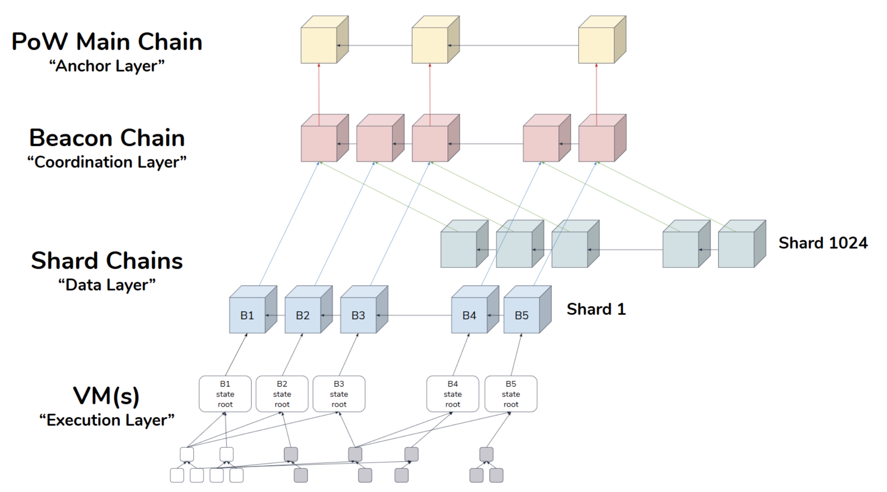

# Serenity Phases

_This page is a WIP. Phase 3-6 still need more detail and for now phase titles have been taken from_ [_here_](https://github.com/ethereum/wiki/wiki/Sharding-roadmap#strongphase-3strong-light-client-state-protocol)_._

### Introduction

Ethereum’s Serenity upgrade will bring Sharding, Proof of Stake, a new virtual machine \(eWASM\) and more. It’s important to understand that this upgrade will not take place at a single point in time. Instead, it will be rolled out in phases. This document attempts to be a reference point for these phases and what each includes.  
  
To start, here is a [nice visual](https://docs.google.com/presentation/d/1G5UZdEL71XAkU5B2v-TC3lmGaRIu2P6QSeF8m3wg6MU/edit#slide=id.g3c326bb661_0_58) from Hsiao-Wei Wang on what the different layers and phases look like.

### Phase 0 - Beacon Chain \(~Late 2019\)

#### **What is included?**

Phase 0 is the name given to the launch of the Beacon Chain. The Beacon Chain will manage the Casper Proof of Stake protocol. As Ben Edgington [puts it](https://media.consensys.net/state-of-ethereum-protocol-2-the-beacon-chain-c6b6a9a69129), “There are a number of aspects to this: managing validators and their stakes; nominating the chosen block proposer for each shard at each step; organising validators into committees to vote on the proposed blocks; applying the consensus rules; applying rewards and penalties to validators; and, being an anchor point on which the shards register their states to facilitate cross-shard transactions.”  
  
Phase 0 will use Casper FFG for finality and RANDAO to select block proposers and committees. 

#### **What will the network look like?**

Once Phase 0 is complete, there will be two active Ethereum chains. For the sake of clarity let’s call them the Eth 1.0 chain \(current, PoW mainchain\) and the Eth 2.0 chain \(new beacon chain\). During this phase, users will be able to migrate their ETH from the Eth 1.0 chain to the Eth 2.0 chain and become validators. However, they will NOT be able to migrate this ETH back. The reason someone may want to do this is that they could be earning interest paid in ETH on the Eth 2.0 chain.

**Important Considerations**

* There will be a minimum amount of ETH stake needed in order to first bootstrap the beacon chain.
* ETH rewards earned by validators won’t be transferable until Phase 2 of the Serenity roll-out as that is when state execution is implemented.
* During Phase 0, all Ethereum transactions and smart contract computations will still occur on the Eth 1.0 chain.
* Once the beacon chain is advancing, Eth 1.0 clients can refer to the beacon chain for finalized beacon blocks and use that as the finality checkpoint for the Eth 1.0 PoW chain.

### Phase 1 - Shard Chains

#### What is included?

Phase 1 will bring shard chains to the Eth 2.0 side. Shard chains are the key to future scalability as they allow parallel transaction throughput. In Phase 1, the beacon chain will now start to manage multiple shards at once.  

#### What will the network look like?

The Eth 1.0 and 2.0 chains will still operate in parallel after Phase 1. Using Binary Large Objects, the shard chains will submit blocks with no transactions. 

#### Important Considerations

* In Phase 0 and Phase 1, the main PoW chain will remain live while testing and transitioning is happening on the Eth 2.0 chain. This means that rewards will be paid to both Phase 0/1 validators as well as the normal PoW block rewards. Therefore, the combined inflation of the 2 chains may spike a bit initially but then start to trend towards the 0-1% range as Phase 2 is implemented.

### Phase 2 - State Execution

#### What is included?

Phase 2 is where the functionality will start to come together. At this point, the beacon chain and shards chains are live, but they are somewhat useless from an end user perspective until smart contracts and transactions can be executed. This will be added in Phase 2.

#### What will the network look like?

Near the end of Phase 2, the current state of the Eth 1.0 PoW chain will be copied over into a shard. This means that for regular users who have not transitioned their ETH over in Phase 0 or Phase 1, it’ll be like nothing happened. The main Eth 1.0 PoW chain will fade at this point due to the difficulty bomb which results in slower blocks and thus lower rewards, and users transitioning over to Eth 2.0.

#### Important Considerations

* This phase may also see the replacement of the EVM with eWASM.
* This phase will only support full nodes

### Phase 3 - Light client state protocol

### Phase 4 - Cross-shard transactions

### Phase 5 - Tight coupling with main chain security

### Phase 6 - Super-quadratic sharding

### Resources

* [Sharding Roadmap](https://github.com/ethereum/wiki/wiki/Sharding-roadmap#strongphase-3strong-light-client-state-protocol)
* [State of Ethereum Protocol](https://media.consensys.net/state-of-ethereum-protocol-2-the-beacon-chain-c6b6a9a69129)
* [Eth 2.0 Specs](https://github.com/ethereum/eth2.0-specs)

