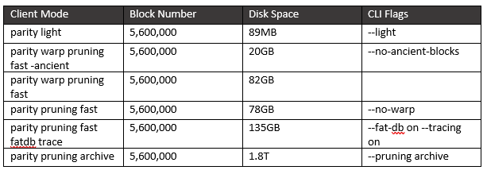

# Running a Node

## Running a node

Anyone is able to run an Ethereum node on their computer. This means that you can participate in validating the blockchain.

## What is a light node?

A light node listens to full nodes it is connected to and only receives relevant Blockchain data periodically. Light nodes are useful for low capacity devices, such as embeded devices or mobile phones, which can't afford to store multiple dozen Gigabytes of blockchain data.

## What is a full node?

Full nodes are responsible for maintaining the balance of the Blockchain. They receive new transactions and blocks, all while participating in block validation. Considering a full nodes validative responsibilities, they are required to hold more precise records of the Blockchain when compared to light nodes - which are only there to listen to full nodes.

## What are the simplest commands for running a light node and full node?

Light node:

* **geth**: --syncmode "light"
* **parity**: --light

Full node:

* **geth**: --syncmode "fast"

The parity default settings are the best for full nodes.

## Table of node settings

### Parity

### Geth

Client / Mode \| Block Number \| Disk Space \| CLI flags \| ==================================\|================\|=============\|====================================\| geth light \| 5\_600\_000 \| 1G \| --syncmode "light" \| geth fast \| 5\_600\_000 \| 120G \| \| geth archive full \| 5\_600\_000 \| 1.1T \| --gcmode=archive --syncmode "full" \|

## Node Benchmarks

### Light mode:

* Parity begins syncing from a hardcoded value \(block \#6219777\) almost immediately, at a rate of approximately 23,500 blocks per minute. With a height at 6,500,000, this takes 15 minutes. Once synced, the light node receives blocks as they get mined and validated by full nodes.
* Geth waits for around 200 seconds before beginning to sync from 2,300 blocks in the past, then periodically receives small bundles of 1 to 10 blocks. The initial sync takes very little time.

### Fast sync:

* For a full node, Parity takes around 6 to 12 hours for a complete sync without warp mode
* For a full node, Geth takes around 6 to 12 hours for a complete sync in fast mode
