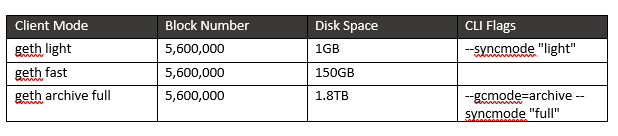

# Running an Ethereum Node

## Summary

Anyone is able to run an Ethereum node on their computer. This means that you can participate in validating transactions and blocks on the Ethereum blockchain. The main node providers are [Geth](https://ethereum.github.io/go-ethereum/downloads/) and [Parity](https://github.com/paritytech/parity-ethereum/releases/tag/v2.0.6). Below are the different types of nodes a user can run, their settings, and what they mean.

## Full nodes

A full node: 

* Stores the full blockchain data available on disk and can serve the network with any data on request. 
* Receives new transactions and blocks while participating in block validation.

### Client settings

**geth**

The default sync mode. Synchronizes a full node doing a [fast synchronization](https://ethereum.stackexchange.com/questions/1161/what-is-geths-fast-sync-and-why-is-it-faster) by downloading the entire state database, requesting the headers first, and filling in block bodies and receipts afterward. Once the fast sync reached the best block of the Ethereum network, it switches to a full sync mode

**geth --syncmode full**

Synchronizes a full node starting at genesis verifying all blocks and executing all transactions. This mode is a bit slower than the fast sync mode but comes with increased security.

**parity**

The default sync mode. Synchronizes a full Ethereum node using [warp synchronization](https://ethereum.stackexchange.com/questions/9991/what-is-paritys-warp-sync-and-why-is-it-faster-than-geth-fast) mode by downloading a snapshot of the 30,000 best blocks and the latest state database.

Once the snapshot is restored, the client switches to full sync and ancient blocks are synchronized from the network in background.

A parity default node serves the network as a full node after it has finished synchronizing.

**parity --no-warp**

Synchronizes a full node starting at genesis verifying all blocks and executing all transactions. This mode is a bit slower than the warp sync mode but comes with increased security.

Both geth full and parity no-warp are to be considered a full Ethereum node because:

* It runs a full blockchain synchronization starting at genesis.
* It replays all transactions and executes all contracts.
* It recomputes the state for each block.
* It keeps all historical blocks on the disk.
* It keeps the most recent states on the disk and prunes ancient states.

## Light nodes

A light node: 
	
* Stores the header chain and requests everything else on demand.
* Can verify the validity of the data against the state roots in the block headers. 

Light nodes are useful for low capacity devices, such as embedded devices or mobile phones, which can't afford to store multiple dozen Gigabytes of blockchain data.

### Client settings

**geth --syncmode light**

Waits for around 200 seconds before beginning to sync from 2,300 blocks in the past, then periodically receives small bundles of 1 to 10 blocks. The initial sync takes very little time.

**parity --light**

Begins syncing from a hardcoded value \(block \#6219777\) almost immediately, at a rate of approximately 23,500 blocks per minute. With a height at 6,500,000, this takes 15 minutes. Once synced, the light node receives blocks as they get mined and validated by full nodes.

**parity --light --no-hardcoded-sync**

Same as --light but syncs from genesis block.

## Archive Nodes

An archive node:

* Stores everything kept in the full node.
* Also builds an archive of historical states.

Archive nodes are only necessary if you want to check the state of an account at any given block height. For example, if you wanted to know the Ether balance an account had at block #4,000,000, you would need to run and query an archive node.

They are commonly only used for services such as block explorers and infrastructure providers like Infura.

### Client Settings

**geth --syncmode full --gcmode archive**

Synchronizes an archive node starting at genesis, thoroughly verifying all blocks, executing all transactions, and writing all intermediate states to disk ("archive").

In Geth, this is called gcmode which refers to the concept of [garbage collection](https://en.wikipedia.org/wiki/Garbage_collection_(computer_science)). Setting it to archive basically turns it off.

**parity --no-warp --pruning archive**

Synchronizes an archive node starting at genesis, thoroughly verifying all blocks, executing all transactions, and writing all intermediate states to disk ("archive").

In Parity, this is called pruning which refers to the concept of [state trie pruning](https://ethereum.stackexchange.com/questions/174/what-is-state-trie-pruning-and-how-does-it-work). Setting it to archive basically turns it off.

## Table of node settings

### Parity

### Geth

## Resources

Huge shout out and thanks to Afri Schoedon's blogs [here](https://dev.to/5chdn/ethereum-node-configuration-modes-cheat-sheet-25l8) and [here](https://dev.to/5chdn/the-ethereum-blockchain-size-will-not-exceed-1tb-anytime-soon-58a) which is where a lot of the information on this page came from.

* [Dispelling Myths About Ethereum's Disk Space](https://www.tokendaily.co/blog/dispelling-myths-about-ethereum-s-disk-space)
